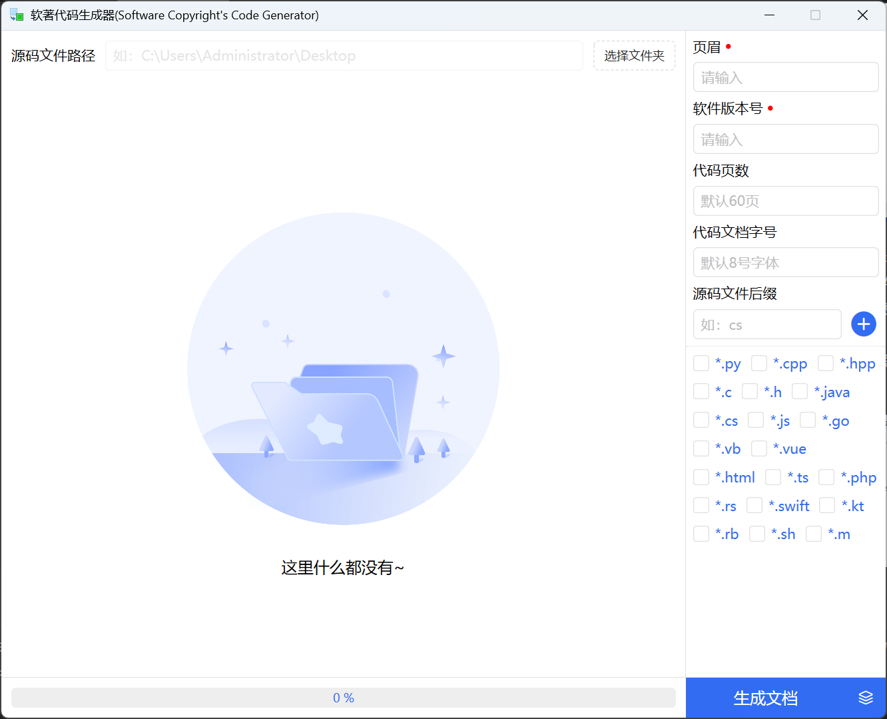
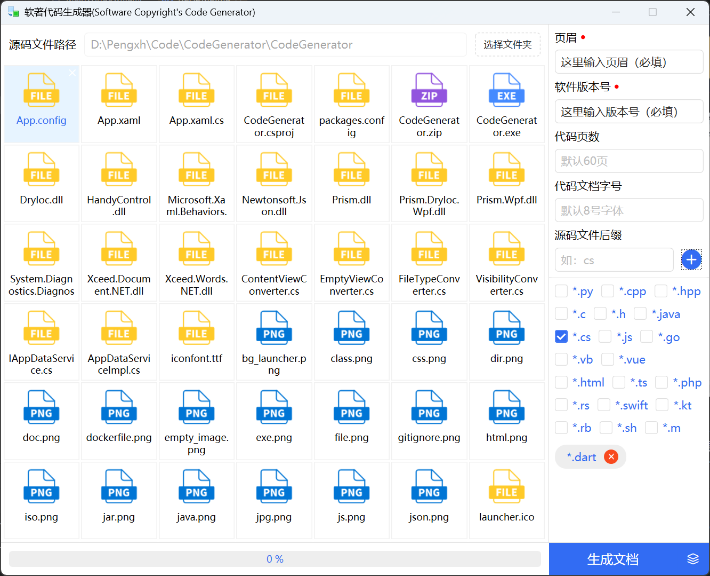
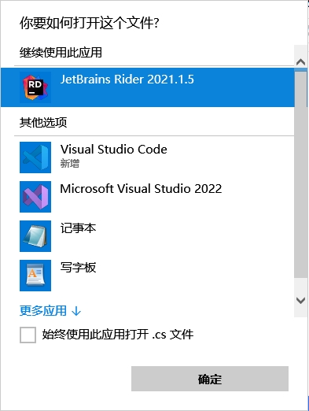

# CodeGenerator
软著代码生成器。

这是一个可以自动生成符合软件著作权源代码文件的工具。

### 下载地址：[CodeGenerator.zip](Example/CodeGenerator.zip)

### 使用方法
1、下载后双击运行，启动后如下图：

2、点击【选择文件夹】选择需要格式化的代码源文件（尽量不要将build文件夹带上，因为编译项目会产生大量编译文件，可能加载起来较慢），然后添加需要格式化的代码后缀，如：java、kt、cs、cpp等，支持多文件类型同时格式化。如果源码超过3000行，会取源码前30页和后30页，每页50行。如下图：

3、双击文件，会使用用户电脑默认软件打开刚刚选中的文件，如下图：

3、最后点击【生成文档】，最后默认会在桌面生成符合软件著作权源代码文件两份（Word文档和Text文档）。如果在桌面没有生成代码文档，在软件主界面右下角设置自定义保存路径，重新生成文档即可

